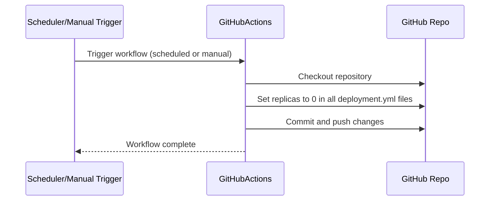
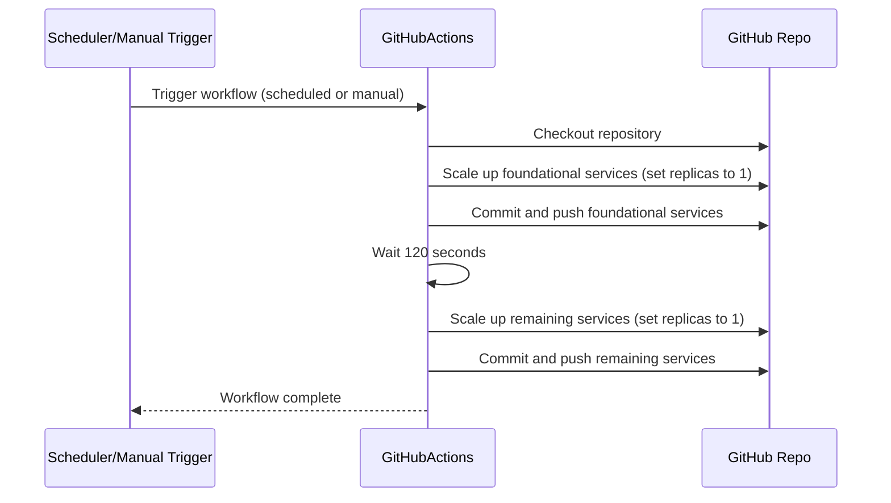
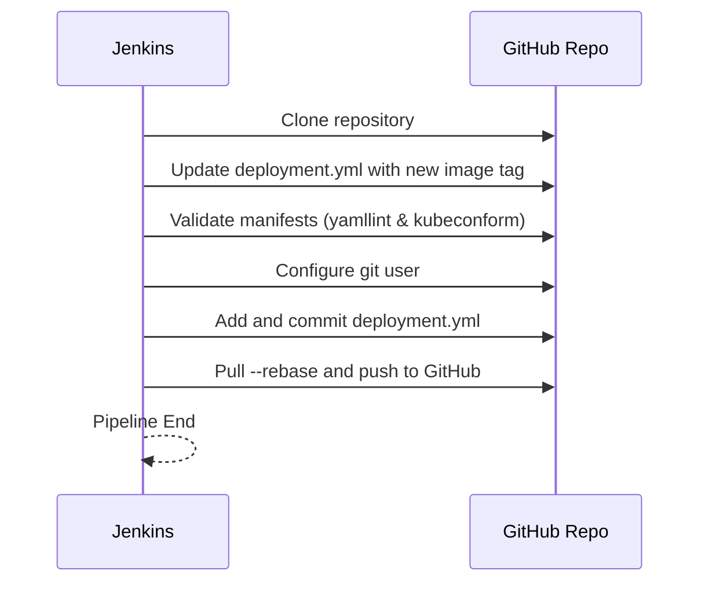

# ecommerce-kubernetes-manifest

This repository contains all the Kubernetes deployment and service manifests for the containers that make up the ecommerce application, you can find the main file of this project [here](https://github.com/FelipeBarretoB/ecommerce-microservice-backend-app). Each service is organized in its own directory with corresponding `deployment.yml` and `service.yml` files. Some also include additional configuration files such as persistent volume claims for databases, sonar and jenkins.

## Services

- **api-gateway**: Entry point for all client requests, routes traffic to backend services.
- **cloud-config**: Centralized configuration server for Spring Cloud applications.
- **favourite-service**: Manages user favourites and wishlists.
- **frontend**: The web frontend for the ecommerce platform.
- **mySql**: MySQL database instance and persistent volume claim.
- **order-service**: Handles order management and processing.
- **payment-service**: Manages payment transactions.
- **product-service**: Manages product catalog and inventory.
- **proxy-client**: Internal proxy client for service communication.
- **service-discovery**: Eureka-based service registry for microservices.
- **shipping-service**: Handles shipping and delivery operations.
- **user-service**: Manages user accounts and authentication.
- **zipkin**: Distributed tracing server for monitoring microservices.
- **jenkins**: Continuous integration and automation server. Note that we use a costume jenkins image that includes the necessary plugins for this project. You can find the Dockerfile [here](/jenkins/Dockerfile).
- **sonar**: SonarQube server for code quality and static analysis.

## Usage

Apply all manifests to your Kubernetes cluster (namespace `ecommerce`):

```sh
kubectl create namespace ecommerce
kubectl apply -f .
```

## Structure

Each service directory contains:

- `deployment.yml`: Deployment specification for the service.
- `service.yml`: Service specification for internal/external access.

The `mySql` directory also includes a `mysql-pvc.yml` for persistent storage.

## Notes

- Update image tags as needed for your environment.
- Adjust resource requests/limits based on your cluster capacity.
- Some services expose NodePorts for external access (e.g., frontend, api-gateway, zipkin, service-discovery, jenkins, sonar).


## Steps to Deploy applicationJS (argocd for jenkins and sonar)

This was based in the following tutorial: https://github.com/HoussemDellai/aks-course/tree/main/290_gitops_argocd  

### Prerequisites
- Azure CLI installed and configured
- You should have run the terraform script to create the infrastructure

once logged in to the azure cli, connect to the aks cluster:

```sh

az aks get-credentials --resource-group ecommerce-rg-2 --name ecommerce-aks --overwrite-existing

```

### Install ArgoCD

```sh
kubectl create namespace argocd

kubectl apply -n argocd -f https://raw.githubusercontent.com/argoproj/argo-cd/stable/manifests/install.yaml

# Expose ArgoCD on public IP
kubectl patch svc argocd-server -n argocd -p '{"spec": {"type": "LoadBalancer"}}'
# if using Powershell
# kubectl patch svc argocd-server -n argocd -p '{\"spec\": {\"type\": \"LoadBalancer\"}}'


# get password then decode base64
kubectl get secret argocd-initial-admin-secret -n argocd -o yaml
```

then create the application file, in this case applicationJS.yaml

if you want to view the argo UI, you can use the following command:

```sh
kubectl get svc argocd-server -n argocd
```

because of the limit of publics IPs in the azure student tier, we're using a ingress controller to expose the ArgoCD UI.

### Install Ingress Controller

```sh
kubectl apply -f https://raw.githubusercontent.com/kubernetes/ingress-nginx/main/deploy/static/provider/cloud/deploy.yaml 

kubectl get svc -n ingress-nginx
```
the second command will show you the public IP of the ingress controller.

create the ingress resource for ArgoCD

```yaml
apiVersion: networking.k8s.io/v1
kind: Ingress
metadata:
  name: jenkins-sonar-ingress
  namespace: jenkinssoanr
  annotations:
    nginx.ingress.kubernetes.io/use-regex: "true"
spec:
  ingressClassName: nginx
  rules:
    - host: <PLACE HOLDER> # replace with your public IP
      http:
        paths:
          - path: /jenkins(/|$)(.*)
            pathType: ImplementationSpecific
            backend:
              service:
                name: jenkins
                port:
                  number: 8080
```

```yaml
apiVersion: networking.k8s.io/v1
kind: Ingress
metadata:
  name: sonar-ingress
  namespace: jenkinssoanr
  annotations:
    nginx.ingress.kubernetes.io/use-regex: "true"
spec:
  ingressClassName: nginx
  rules:
    - host: <PLACE HOLDER> # replace with your public IP
      http:
        paths:
          - path: /sonar(/|$)(.*)
            pathType: ImplementationSpecific
            backend:
              service:
                name: sonar
                port:
                  number: 9000
```


and add the public IP in the `hosts` section of the `applicationJS.yaml` 

then apply the ingress manifest:

```sh
kubectl apply -f jenkins-sonar-ingress.yml
```

if you have problems check that the ingress controller is running

```sh
ingress-nginx   ingress-nginx-admission-create-mj62z               0/1     Completed   0              21m
ingress-nginx   ingress-nginx-admission-patch-988tm                0/1     Completed   1              21m
ingress-nginx   ingress-nginx-controller-6bb485db4b-8cqr9          1/1     Running     0              21m
```

it's normal for the first two pods to be in `Completed` state, the last one should be in `Running` state.

Now, you pray to whatever deity you believe in, and hope that everything works as expected.

### Important files

#### note
Because of azure students tier limitations, we have to clusters in different regions, US east has all of the app and Europe west has the jenkins and sonar services

- `applicationsetJS.yml`: ArgoCD application manifest for deploying the jenkins and sonar application.

- `applicationset.yml`: ArgoCD application manifest for ecommerce app.

- `configmap-ecommerce.yml`: ConfigMap for the ecommerce application, containing environment variables and configurations.

- `*-ingress.yml`: Again, because of azure limitations we had limited public ips, to solve this, we used nginx's ingress controller. All the ingress ips are defined in this files.

## Pipelines

### daily scale up and down
This pipeline is used to scale up the application during the day and scale it down during the night, to save costs. It changes the amount of replicas from 1 to 0 during late night hours (11pm to 4am UTC-5) and then scales it back up to 1 during the day (4am to 11pm UTC-5). ArgosCD will catch the changes and apply them to the cluster.

heres the pipeline for scale down:



heres the pipeline for scale up:



The only difference between the two pipelines is that the scale up pipeline waits 120 seconds for the foundational services to be up and running before scaling up the remaining services.

### Jenkins pipeline

Now this pipeline is in charged of making sure the manifest files are up to date with the latest changes in the dockerhub repositories, it's triggered when ever a new image is pushed to the dockerhub by the ecommerce pipelines.
Also, it uses Kubeconform and ymallint to make sure the manifests are valid and conform to the kubernetes standards, this is why we use a custom jenkins image that includes the necessary plugins and tools to run this pipeline.


---